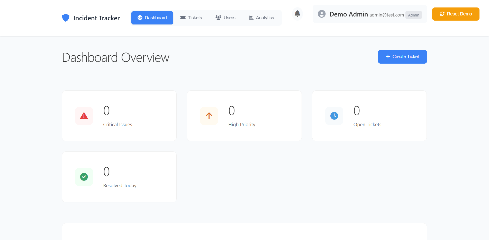
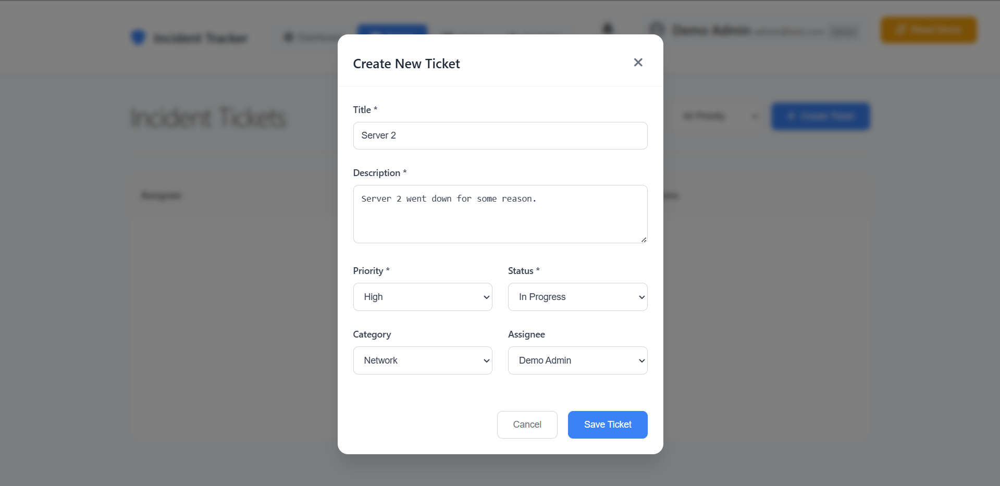
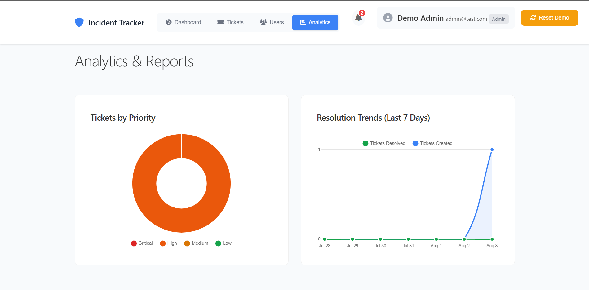
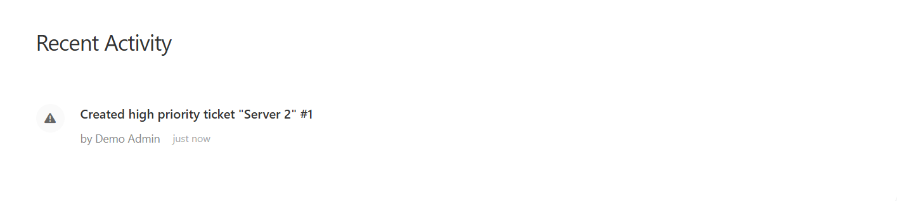

# Incident Tracker

A modern incident management system for IT support teams to track and resolve service tickets efficiently. Built with Node.js, Express, PostgreSQL, and vanilla JavaScript.

**[🔗 Live Demo](https://incident-tracker-production.up.railway.app/)**

**Demo Credentials:**
- Email: `admin@test.com`
- Password: `password123`

## Features

- **Ticket Management**: Create, update, assign, and track incident tickets
- **User Management**: Role-based access (Admin, Agent, Viewer)
- **Real-time Dashboard**: Live metrics and activity feed
- **Comments System**: Internal and external ticket communication
- **Search & Filtering**: Advanced search with status and priority filters
- **SLA Monitoring**: Automated tracking with breach notifications
- **Analytics**: Charts and reports for performance tracking
- **Responsive Design**: Mobile-optimized interface

## Technology Stack

**Backend:**
- Node.js & Express.js
- PostgreSQL database
- JWT authentication
- bcrypt password hashing
- Winston logging

**Frontend:**
- Vanilla JavaScript (ES6+)
- CSS Grid & Flexbox
- Chart.js for analytics
- Font Awesome icons
- Responsive design

## Quick Start

### Prerequisites
- Node.js 16+
- PostgreSQL 12+

### Installation

1. **Clone and install**
   ```bash
   git clone https://github.com/definitelyavi/incident-tracker.git
   cd incident-tracker
   npm install
   ```

2. **Set up database**
   ```bash
   createdb incident_tracker
   psql incident_tracker < database/postgresql/init.sql
   ```

3. **Configure environment**
   ```bash
   cp .env.example .env
   # Edit .env with your database credentials
   ```

4. **Start the application**
   ```bash
   npm run dev
   ```

5. **Access at** http://localhost:3001

## Live Demo

**Production Demo:** https://incident-tracker-production.up.railway.app/

**Demo Credentials:**
- Email: `admin@test.com`
- Password: `password123`

*Note: Demo data resets periodically. Feel free to create test tickets and explore all features.*

## Screenshots

### Dashboard Overview


### Ticket Management


### Analytics & Reporting


### Recent Activity


### Demo Setup

```bash
# Create demo users automatically
curl -X POST http://localhost:3001/api/auth/setup-demo
```

**Demo Login:**
- Email: `admin@test.com`
- Password: `password123`

## Environment Configuration

```env
# Required
NODE_ENV=development
PORT=3001
PG_DATABASE=incident_tracker
PG_USER=your_username
PG_PASSWORD=your_password
JWT_SECRET=your-secret-key-here
JWT_REFRESH_SECRET=your-refresh-secret-here

# Optional
PG_HOST=localhost
PG_PORT=5432
LOG_LEVEL=info
```

## Project Structure

```
incident-tracker/
├── backend/
│   ├── config/          # Database and app configuration
│   ├── middleware/      # Authentication, validation, error handling
│   ├── routes/          # API endpoints
│   ├── services/        # Business logic (SLA monitoring)
│   └── utils/           # Logging and utilities
├── frontend/
│   ├── css/            # Stylesheets
│   ├── js/             # JavaScript modules
│   └── index.html      # Main application
├── database/
│   └── postgresql/     # Database schema
└── server.js           # Application entry point
```

## API Usage

### Authentication
```javascript
// Login
POST /api/auth/login
{
  "email": "user@example.com",
  "password": "password123"
}

// Get current user
GET /api/auth/me
Authorization: Bearer <token>
```

### Tickets
```javascript
// Create ticket
POST /api/tickets
{
  "title": "Server issue",
  "description": "Web server not responding",
  "priority": "high",
  "category": "hardware"
}

// Get tickets
GET /api/tickets?status=open&priority=high
```

## Key Features Demonstrated

### Role-Based Security
- Admins: Full system access
- Agents: Ticket management and user viewing
- Viewers: Read-only access to own tickets

### Real-time Updates
- Live dashboard metrics
- Instant notification system
- Activity feed updates

### Data Visualization
- Priority distribution charts
- Resolution trend analysis
- SLA compliance tracking

## Database Design

Core tables: `users`, `tickets`, `comments`, `notifications`, `settings`

Key relationships:
- Users can report and be assigned tickets
- Tickets have multiple comments
- Audit trail for all changes

## Deployment

### Development
```bash
npm run dev
```

### Production
```bash
npm start
```

## Testing

```bash
# Run tests
npm test

# Run with coverage
npm run test:coverage
```

## Contributing

1. Fork the repository
2. Create a feature branch
3. Make your changes
4. Add tests for new features
5. Submit a pull request

---

**Note**: This project demonstrates full-stack development skills including database design, API development, authentication, and responsive frontend development.
